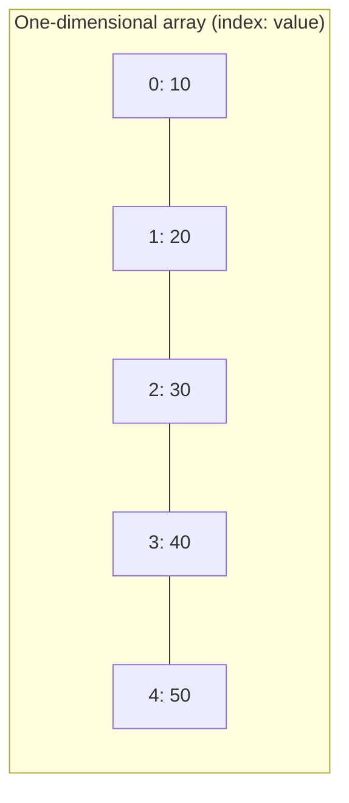
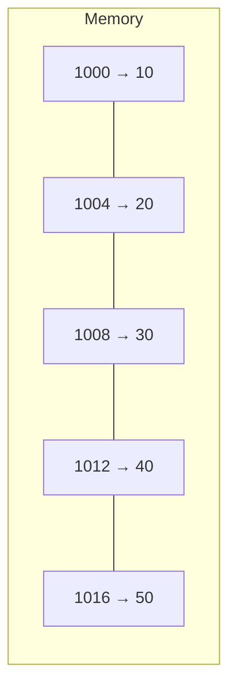
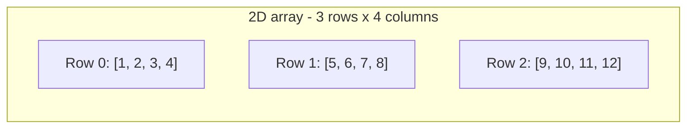
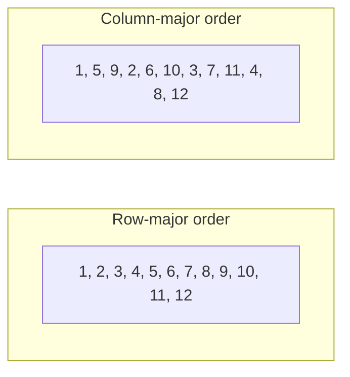
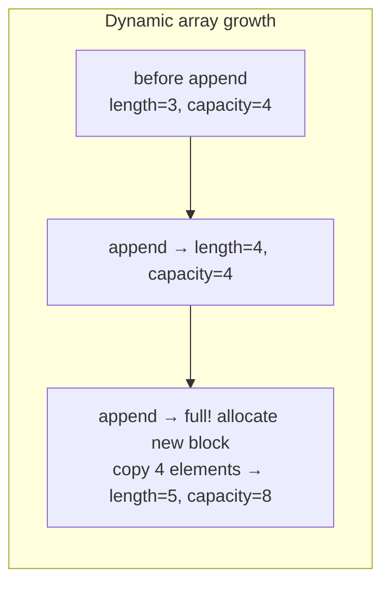
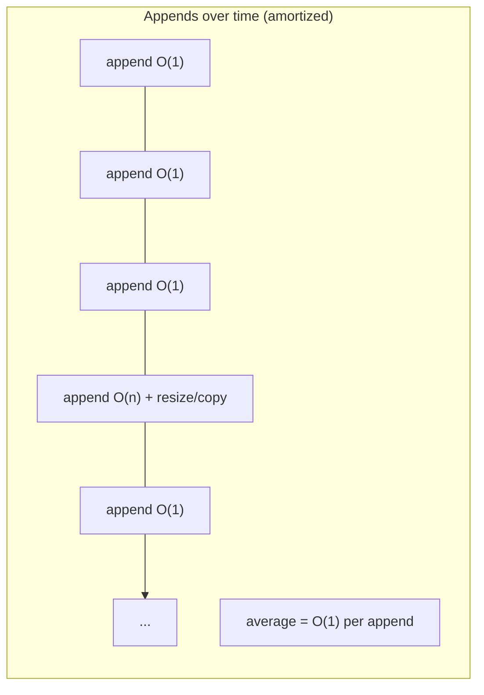

# Introduction to the Array Data Structure

An array is a data structure that stores a collection of elements in a
contiguous block of memory. Every element in the array is accessed by its
index, which starts at `0`.

## Key characteristics

- Elements are stored next to each other in memory.
- Each element is the same data type.
- Access time is constant: `O(1)` by index.
- The size is usually fixed once the array is created.

Given the array:

```text
[10, 20, 30, 40, 50]
```

We can access any element by index:

```text
array[0] -> 10
array[2] -> 30
array[4] -> 50
```

## One-dimensional arrays

A one-dimensional array is a single row of elements. It is the simplest
form of an array:



Each element sits at a consecutive index, and the address of an element
depends on three things:

1. The **base address** — the memory address of the first element.
2. The **size of the data type** — how many bytes one element occupies.
3. The **index** of the element.

## How array indexing maps to memory addresses

Because the elements are contiguous, the memory address of
`array[i]` can be computed directly:

```text
address(array[i]) = base_address + (i * size_of_element)
```

For example, suppose an integer array starts at memory address `1000`
and each integer takes `4` bytes:

```text
array[0] -> 1000 + (0 * 4) = 1000
array[1] -> 1000 + (1 * 4) = 1004
array[2] -> 1000 + (2 * 4) = 1008
array[3] -> 1000 + (3 * 4) = 1012
```



This arithmetic is why access by index is `O(1)`: the CPU does one
multiplication and one addition, then reads the memory location directly.
No scanning is needed. This also means the data type size matters — in
languages like C, `int` (4 bytes) and `double` (8 bytes) produce
different addresses for the same index.

## Multidimensional arrays

A multidimensional array is an array of arrays. The most common case is
a two-dimensional array, which we can visualise as a grid with rows and
columns.



A cell is addressed by two indices, `array[row][col]`:

```text
array[0][0] -> 1
array[1][2] -> 7
array[2][3] -> 12
```

### Row-major vs column-major layout

Memory is still one long, contiguous sequence. A 2D array must be
flattened into that sequence in a determined order:

- **Row-major** (used by C and Python): the whole first row is stored,
  then the whole second row, and so on.
- **Column-major** (used by Fortran): the whole first column is stored,
  then the second column, and so on.



For a 2D array with `R` rows, `C` columns and row-major layout, the
address formula becomes:

```text
address(array[i][j]) = base_address + (i * C + j) * size_of_element
```

In Python, a multidimensional array is usually a list of lists:

```python
matrix = [
    [1, 2, 3, 4],
    [5, 6, 7, 8],
    [9, 10, 11, 12],
]

print(matrix[1][2])        # 7
```

Note that in Python the "rows" are references to other lists, so the
contiguous-memory guarantee applies to each inner list, not necessarily
to all rows together.

## How arrays work in Python

Python does not have a built-in "array" type. The closest built-in
structure is the **list**, which behaves like a dynamic array: it can grow
and shrink, and it stores elements in memory next to one another.

Python also ships with the `array` module, which provides a typed
array that only holds one data type.

## Python implementation with lists

```python
# CREATION
fruits = ["apple", "banana", "cherry"]
print(fruits)              # ['apple', 'banana', 'cherry']

# ACCESS
print(fruits[0])           # apple
print(fruits[-1])          # cherry

# UPDATE
fruits[1] = "blueberry"
print(fruits)              # ['apple', 'blueberry', 'cherry']

# TRAVERSE
for fruit in fruits:
    print(fruit)

# APPEND (dynamic size)
fruits.append("date")
print(fruits)              # ['apple', 'blueberry', 'cherry', 'date']

# LENGTH
print(len(fruits))         # 4
```

## Python implementation with the array module

The `array` module stores only one data type, which is closer to a
classic array from languages like C or Java.

```python
from array import array

numbers = array("i", [1, 2, 3, 4, 5])   # "i" means signed integer

print(numbers[0])          # 1
print(numbers[3])          # 4
numbers[2] = 99
print(numbers)             # array('i', [1, 2, 99, 4, 5])
```

The type code is the first argument and decides both the data type and
how many bytes each element uses in memory:

| Type code | C type            | Bytes |
| --------- | ----------------- | ----- |
| `'b'`     | signed char       | 1     |
| `'B'`     | unsigned char     | 1     |
| `'h'`     | signed short      | 2     |
| `'H'`     | unsigned short    | 2     |
| `'i'`     | signed int        | 4     |
| `'I'`     | unsigned int      | 4     |
| `'l'`     | signed long       | 8     |
| `'f'`     | float             | 4     |
| `'d'`     | double            | 8     |

Examples with other types:

```python
from array import array

floats = array("f", [1.5, 2.25, 3.75])    # float, 4 bytes each
doubles = array("d", [1.5, 2.25, 3.75])   # double, 8 bytes each
chars = array("b", [65, 66, 67])           # signed char, 1 byte each
unsigned = array("I", [10, 20, 30])       # unsigned int

print(floats[1])              # 2.25
print(doubles[1])             # 2.25
print(chr(chars[2]))          # C
print(unsigned[0])            # 10
```

The byte size matters for the memory address formula discussed earlier:
`floats[3]` lives at `base + 3 * 4`, while `doubles[3]` lives at
`base + 3 * 8`.

## Static vs dynamic arrays

### Static array

A **static array** has a fixed size that is decided when the array is
created and can never change. This is what you get in C or Java:

```c
int numbers[5];   // Cannot grow beyond 5 elements
```

Characteristics:

- The size is fixed at creation time.
- All memory is allocated up front.
- No capacity check or resizing is needed.
- Dangerous to fill up: writing past the end leads to overflow.

### Dynamic array

A **dynamic array** grows automatically when you add more elements than
it currently fits. It gives you static-array speed, but with a
resizable capacity. C++ `std::vector`, Java `ArrayList` and Python
lists are all dynamic arrays.

A dynamic array keeps two numbers internally:

- `length` — how many elements are currently in use.
- `capacity` — how many elements the allocated memory can hold.



### How growth works

1. A new, larger block of memory is allocated (commonly **2x** the
   current capacity).
2. Every existing element is copied into the new block.
3. The old block is released.
4. The new element is placed at the end.

A resize is expensive because it copies every element, so dynamic
arrays grow by a multiplicative factor rather than by one element at a
time. Growing by a factor of 2 turns repeated appends into an
amortized `O(1)` operation.

## Amortized complexity

**Amortized analysis** looks at the cost of a long sequence of
operations and averages the cost out over all of them. The expensive
resize happens rarely, so its cost is "spread" across the many cheap
appends that paid for it.

### Why growth by a factor of 2 is amortized O(1)

Think about a dynamic array that starts with capacity `1` and doubles
whenever it is full. During `n` appends, the copy costs are:

```text
1 + 2 + 4 + 8 + ... + n bytes copied   (~ log2(n) resizes)
```

The last resize dominates, and the sum is roughly `2n`. So for `n`
appends, the total work is about `O(2n)`, which averages to `O(1)` per
append. Without doubling — growing by exactly one slot each time — the
total would be `O(n²)`, or `O(n)` per append.



```python
items = []                 # length=0, capacity=0
for i in range(5):
    items.append(i)        # occasionally triggers a resize + copy
```

Most calls to `append` are cheap; only a few trigger a copy, which is why
Python lists promise "amortized `O(1)`" appends.

## Complexity

### Time complexity

| Operation                 | Complexity |
| ------------------------- | ---------- |
| Access by index           | `O(1)`     |
| Search / linear scan      | `O(n)`     |
| Update by index           | `O(1)`     |
| Append (amortized, list)  | `O(1)`     |
| Insert / delete in middle | `O(n)`     |

### Why each operation costs that much

#### Access by index - O(1)

As shown in the memory-mapping section, the address of an element is
computed directly:

```text
address = base_address + index * size_of_element
```

One multiplication, one addition, then a direct read from that address.
The CPU jumps straight to the location — no scanning is involved.

#### Update by index - O(1)

Updating uses the same address arithmetic and writes to that exact
location:

```text
array[2] = 99   # base + (2 * size) -> write 99 there
```

Since the address is known instantly and nothing needs to shift, an
update is just as fast as a read.

#### Search / linear scan - O(n)

Array elements are unordered, so there is no way to jump to a value. In
the worst case the value is at the last position — or missing — and every
one of the `n` elements must be checked:

```text
for value in array:      # worst case: check all n elements
    if value == target:
        return True
```

Constant-time indexing does not help here, because the position of a
value is unknown.

#### Insert / delete in the middle - O(n)

To keep the array contiguous, every element after the insertion or
deletion point must be moved by one slot. For example, inserting `10`
at index `2`:

```text
before: [1, 2, 3, 4, 5]
after:  [1, 2, 10, 3, 4, 5]
              ^--  3, 4, 5 all shifted right by one
```

Up to `n` elements need to shift, so the operation is `O(n)` regardless
of how fast a single move is.

#### Append (list) - amortized O(1)

Appending normally just writes the new value at `length` and increments
the counter — a single, `O(1)` step:

```text
items = [1, 2, 3]
items.append(4)   # write at index 3, length becomes 4
```

Only when the array is full does a resize happen, and that rare `O(n)`
copy cost is spread across all the preceding cheap appends by doubling
explained in the amortized section — so the average stays `O(1)`.

### Space complexity

- `O(n)` to store `n` elements.

## Key idea

> An array stores elements in contiguous memory, so any element can be
> located instantly with `address = base + index * size_of_element` —
> that is why indexing is `O(1)`. Static arrays have a fixed size;
> dynamic arrays grow by copying into a larger block, making appends
> amortized `O(1)`. Python lists are dynamic arrays, while the `array`
> module provides a typed, fixed data type version.